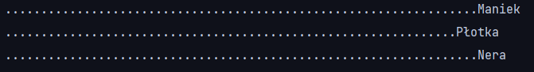

# HippodromeGame

This is simple console simulation of horse race with three participants
(you can always add more by creating new horse objects in **Hippodrome.java**).
The purpose of this game is to have some fun and maybe to try to guess which
one of the players would win.

--------------------------
# Launching the game

In order to start the game all you have to do is run the **Hippodrome.main()**. You should see something like this:

----------------
# The gameplay

During the gameplay you will notice dots constantly
showing behind the horses, as well as the image of animals' run.
This is pretty simple visualisation of the distance travelled
by the participants of the race.

Couple of examples:

After covering the whole distance by first horse the race will be ended
and the winner will be announced on the console. 

It should look for example like this:

----------------------
# Summary  

This project was made just to kill some time and have fun with my daily dose of programming.
 **Hope you like it!**